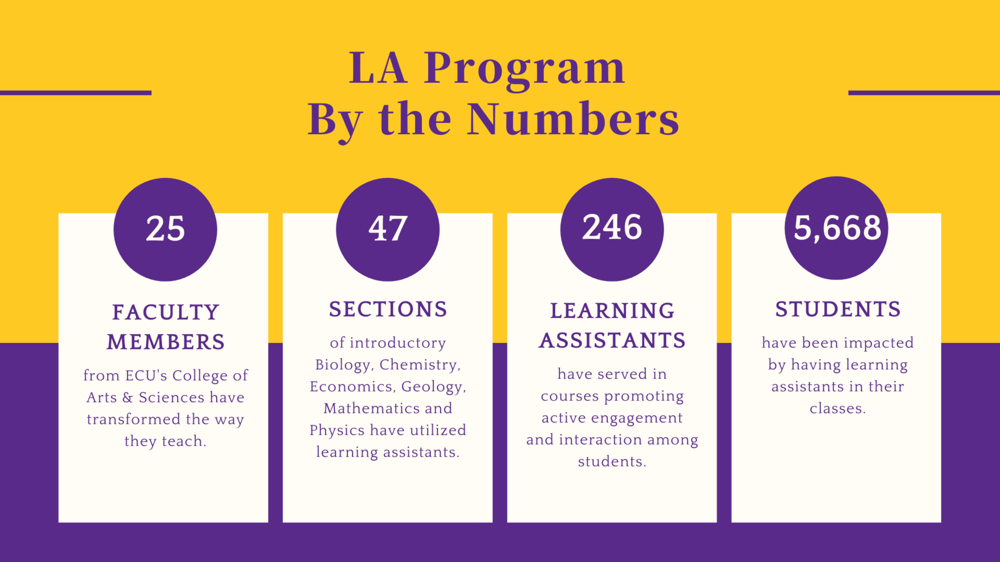

---
# Feel free to add content and custom Front Matter to this file.
# To modify the layout, see https://jekyllrb.com/docs/themes/#overriding-theme-defaults
title: About me
permalink: index.html
---

If you are a student who wants to get involved with research in my lab, hit the [Get Started](getStartedPER.html) tab above.

[PDF CV](./files/swolfCV.pdf)

## Current Position

I am currently an Assistant Professor of Physics at East Carolina University.  I am also the Learning Assistant Program Director at ECU.  I was hired as part of the [ECU STEM CoRE](https://stemcore.ecu.edu) (Collaborative for Research in Education).  Together we are working with ECU faculty to make more STEM professionals (especially teachers).  My research interests focus on the development of science practices, and how those different practices interact with different learning environments.  For example, our [XLABs Project](http://blog.ecu.edu/sites/xlabs/) investigates how science practices transfer between different scientific disciplines in laboratory contexts.  In addition to the assessment of scientific practices, my personal research interests include investigating novel ways that we can apply networks in educational settings for both descriptive and modeling purposes.

I am also the program director for the [ECU LA Program](https://laprogram.ecu.edu/).  As a part of this program, I work with students who are interested in helping others learn, and we all work together to promote better learning outcomes especially in introductory courses.  I also work with faculty to get them to think about how they are engaging students in the classroom and encourage more active participation from students in their classroom.

## Education and Background

I earned my B.S. in physics and mathematics from [Valparaiso University](https://www.valpo.edu/physics-astronomy/) in 2003.  I earned my M.S. in [physics from Dartmouth College](https://physics.dartmouth.edu/) in 2005 picking up some FORTRAN and studying a bit of space weather.  After about a year working at a community college at teaching at a rural high school, I decided to go back to school for my [Ph.D. at Michigan State University](https://www.pa.msu.edu/), which I completed in 2012.  My thesis involved the use of networks to describe the ways that students, and physics faculty, categorize introductory physics problems.  I postdoc'd at Michigan State in the [CREATE for STEM Institute](http://create4stem.msu.edu) with Mathematics Ed and Physics Ed researchers.  After that, I also spent a year as a lecturer at [Texas State University, Department of Physics](https://www.txstate.edu/physics/), where I gained experience working with their Learning Assistant Program, and maintain some active research collaborations.

